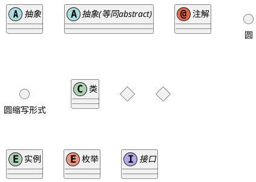
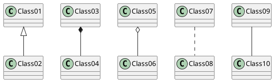
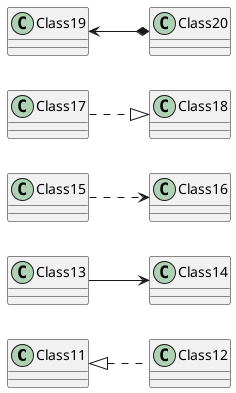
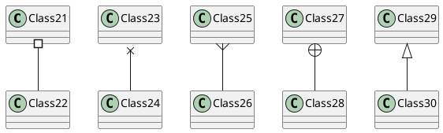
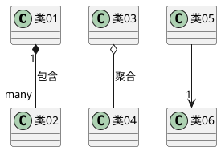
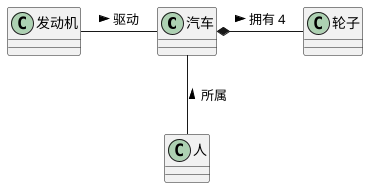
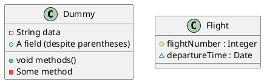
```puml
@startuml
/'
{static}    静态属性
{abstract}  抽象方法
'/
class Dummy {
  {static} String id
  {abstract} void methods()
}
@enduml
```
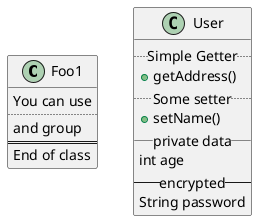
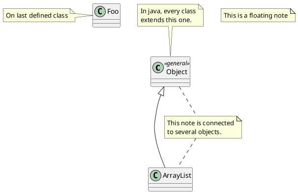
```puml


/' 可以在注释种使用html '/
@startuml

class Foo
note left: On last defined class

note top of Object
  In java, <size:18>every</size> <u>class</u>
  <b>extends</b>
  <i>this</i> one.
end note

note as N1
  This note is <u>also</u>
  <b><color:royalBlue>on several</color>
  <s>words</s> lines
  And this is hosted by 
end note

@enduml
```
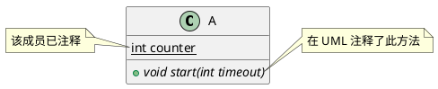
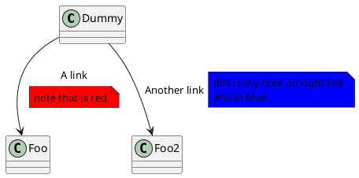
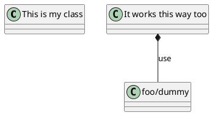
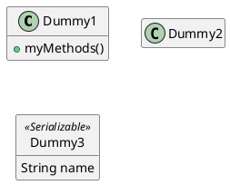
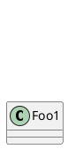
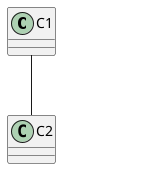

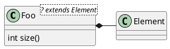
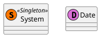
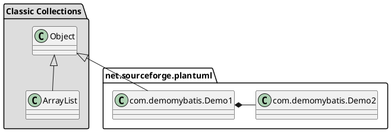
```puml
/' 包之间的连线 '/
@startuml

skinparam packageStyle rectangle

package foo1.foo2 {
}

package foo1.foo2.foo3 {
  class Object
}

foo1.foo2 +-- foo1.foo2.foo3

@enduml
```
```puml
/' 不同场景可选用不同的包样式 '/
@startuml
scale 750 width
package foo1 <<Node>> {
  class Class1
}

package foo2 <<Rectangle>> {
  class Class2
}

package foo3 <<Folder>> {
  class Class3
}

package foo4 <<Frame>> {
  class Class4
}

package foo5 <<Cloud>> {
  class Class5
}

package foo6 <<Database>> {
  class Class6
}

@enduml
```
```puml
/' 定义关系类 '/
@startuml
class Student {
  Name
}
Student "0..*" - "1..*" Course

class Enrollment {
  drop()
  cancel()
}

(Student, Course) .. Enrollment
@enduml

```
```puml

/' 同级关联 '/
@startuml
class 站台 {
    +名称: 字符串
}

class 通道 {
    +花费: 剩余时间
}

<> 结点

通道 . 结点
结点 - "从 0..*" 站台
结点 - "到 0..* " 站台
@enduml

```
```puml
/' 样式修改 '/
@startuml

skinparam class {
BackgroundColor PaleGreen
ArrowColor SeaGreen
BorderColor SpringGreen
}
skinparam stereotypeCBackgroundColor YellowGreen

类01 "1" *-- "many" 类02 : 包含

类03 o-- 类04 : 聚合

@enduml
```
```puml

@startuml

skinparam class {
BackgroundColor PaleGreen
ArrowColor SeaGreen
BorderColor SpringGreen
BackgroundColor<<Foo>> Wheat
BorderColor<<Foo>> Tomato
}
skinparam stereotypeCBackgroundColor YellowGreen
skinparam stereotypeCBackgroundColor<< Foo >> DimGray

类1 <<Foo>>
类3 <<Foo>>
类1 "1" *-- "*" 类2 : 包含(contains)

类3 o-- 类4 : 聚合(aggregation)

@enduml
```
```puml


@startuml

skinparam backgroundcolor AntiqueWhite/Gold
skinparam classBackgroundColor Wheat|CornflowerBlue

class 类1 #red-green
note left of 类1 #blue\9932CC
  这是foo类的
  渐变颜色
end note

package 包1 #GreenYellow/LightGoldenRodYellow {
  class 类2
}

@enduml
```
```puml

/' 布局 '/
@startuml

class Bar1
class Bar2
together {
  class Together1
  class Together2
  class Together3
}
Together1 - Together2
Together2 - Together3
Together2 -[hidden]--> Bar1
Bar1 -[hidden]> Bar2
@enduml
```
```puml

@startuml
' Split into 4 pages
page 2x2
skinparam pageMargin 10
skinparam pageExternalColor gray
skinparam pageBorderColor black

class BaseClass

namespace net.dummy #DDDDDD {
    .BaseClass <|-- Person
    Meeting o-- Person

    .BaseClass <|- Meeting

}

namespace net.foo {
  net.dummy.Person  <|- Person
  .BaseClass <|-- Person

  net.dummy.Meeting o-- Person
}

BaseClass <|-- net.unused.Person
@enduml
```
```puml


/' 继承和实现'/
@startuml
class ArrayList implements List
class ArrayList extends AbstractList
@enduml
```
```puml

/' 线条样式 '/
@startuml
left to right direction
title 使用方括号([])表示的线样式（无标签版）

class foo类
class bar类
bar类1 : [bold]
bar类2 : [dashed]
bar类3 : [dotted]
bar类4 : [hidden]
bar类5 : [plain]

foo类 --> bar类: 标签
foo类 -[bold]-> bar类1
foo类 -[dashed]-> bar类2
foo类 -[dotted]-> bar类3
foo类 -[hidden]-> bar类4
foo类 -[plain]-> bar类5
@enduml
```
```puml


@startuml
title 使用方括号([])表示的线颜色
class foo类
class bar类
class bar类1
class bar类2
class bar类3

foo类 --> bar类            : [默认]
foo类 -[#red]-> bar类1     : [红]
foo类 -[#green]-> bar类2   : [绿]
foo类 -[#blue]-> bar类3    : [#蓝]
'foo类 -[#blue;#yellow;#green]-> bar类4
@enduml
```
```puml

@startuml
title 使用方括号([])表示的线宽度
class foo类
class bar类
bar类1 : [thickness=1]
bar类2 : [thickness=2]
bar类3 : [thickness=4]
bar类4 : [thickness=8]
bar类5 : [thickness=16]

foo类 --> bar类                 : ∅
foo类 -[thickness=1]-> bar类1   : [1]
foo类 -[thickness=2]-> bar类2   : [2]
foo类 -[thickness=4]-> bar类3   : [4]
foo类 -[thickness=8]-> bar类4   : [8]
foo类 -[thickness=16]-> bar类5  : [16]

@enduml
```
```puml

@startuml
title 使用方括号([])表示的线混合样式
class foo类
class bar类
bar类1 : [#red,thickness=1]
bar类2 : [#red,dashed,thickness=2]
bar类3 : [#green,dashed,thickness=4]
bar类4 : [#blue,dotted,thickness=8]
bar类5 : [#blue,plain,thickness=16]

foo类 --> bar类                             : ∅
foo类 -[#red,thickness=1]-> bar类1          : [#red,1]
foo类 -[#red,dashed,thickness=2]-> bar类2   : [#red,dashed,2]
foo类 -[#green,dashed,thickness=4]-> bar类3 : [#green,dashed,4]
foo类 -[#blue,dotted,thickness=8]-> bar类4  : [blue,dotted,8]
foo类 -[#blue,plain,thickness=16]-> bar类5  : [blue,plain,16]
@enduml
```
```puml

@startuml
class foo类
foo类 --> bar类 : 默认
foo类 --> bar类1 #line:red;line.bold;text:red  : 红色粗线
foo类 --> bar类2 #green;line.dashed;text:green : 绿色断线
foo类 --> bar类3 #blue;line.dotted;text:blue   : 蓝色点线
@enduml
```
```puml


@startuml
abstract   抽象类
annotation 注解     #pink ##[bold]red
class      类      #palegreen ##[dashed]green
interface  接口    #aliceblue ##[dotted]blue
@enduml
```
```puml


@startuml
class Foo类 {
+ 字段1
+ 字段2
}

class Bar类 {
+ 字段3
+ 字段4
}

Foo类::字段1 --> Bar类::字段3 : foo
Foo类::字段2 --> Bar类::字段4 : bar
@enduml
```


```puml
@startmindmap
caption figure 1
title My super title

* <&flag>Debian
** <&globe>Ubuntu
*** Linux Mint
*** Kubuntu
*** Lubuntu
*** KDE Neon
** <&graph>LMDE
** <&pulse>SolydXK
** <&people>SteamOS
** <&star>Raspbian with a very long name
*** <s>Raspmbc</s> => OSMC
*** <s>Raspyfi</s> => Volumio

header
My super header
endheader

center footer My super footer

legend right
  Short
  legend
endlegend
@endmindmap

```
```puml
@startmindmap
Title sss
* class Template
**:
<code>
import pandas
</code>
;
**: ss
# 111
### sd
;


@endmindmap

```